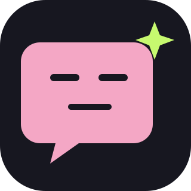
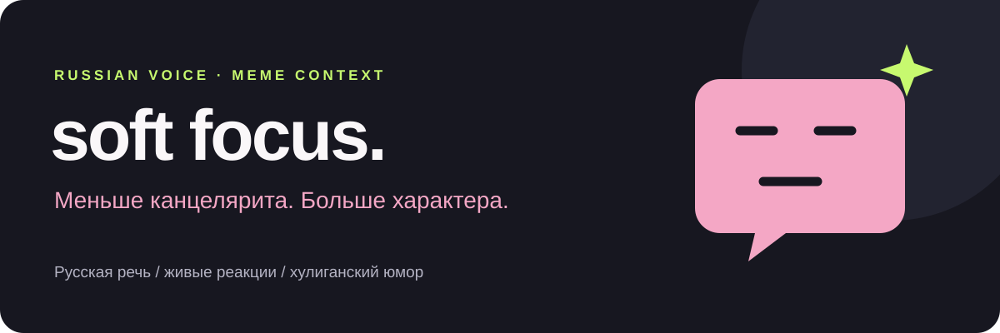

<p align="center">
  
</p>

<h1 align="center">Soft Focus</h1>

<p align="center"><em>Название спокойное. Реплики — не всегда.</em></p>

<p align="center">
  <a href="LICENSE"></a>
  <a href="references/patterns.md"></a>
  <a href="SKILL.md"></a>
  <a href="https://github.com/ADanMan/soft-focus/stargazers"></a>
</p>

<p align="center">
  <a href="#установка">Установка</a> ·
  <a href="#до-и-после">До и после</a> ·
  <a href="#как-это-работает">Паттерны</a> ·
  <a href="#источники-и-обновления">Источники</a>
</p>

---

<p align="center"></p>

Знаете человека, который одним «это рофл?» заканчивает презентацию на сорок слайдов? Soft Focus помогает агенту писать с такой же разговорной прямотой: по-русски, с характером и понятной шуткой.

Скилл соединяет редактуру Humanizer, русскоязычный мемный контекст и общие приёмы хулиганской комедии. Получаются короткие реакции, перепалки и бытовой абсурд. Смысл, числа и условия исходного текста сохраняются.

## До и после

**Обычный текст**

> Команда потратила три недели на согласование цвета кнопки.

**С Soft Focus**

> Три недели выбирали цвет кнопки. Не выкупаю, вы её выбирали или делили после развода?

**Ещё одна ситуация**

> Третий созвон по отмене созвонов. Работать, я так понимаю, уже не планируем.

По умолчанию — прямая дерзость или сухой подкол:

> Мы ценим ваше время. Поэтому потратим его вместе.

Отношение слышно в самой реплике. После шутки проход Humanizer убирает натужную разговорность и лишние эмоции.

Это авторские примеры, а не цитаты комиков. Смешность зависит от контекста и аудитории; скилл не обещает идеальный панч на каждом запуске.

## Установка

### Codex

Клонируйте репозиторий в каталог личных скиллов:

```bash
git clone https://github.com/ADanMan/soft-focus.git ~/.codex/skills/soft-focus
```

Откройте новую сессию и вызовите:

```text
$soft-focus перепиши этот текст по-русски, живо и с острым юмором: …
```

Если каталог уже существует, проверьте локальные изменения перед обновлением. Для чистого клона:

```bash
git -C ~/.codex/skills/soft-focus pull --ff-only
```

### Claude Code

Структура использует стандартный `SKILL.md`. Для ручной установки:

```bash
git clone https://github.com/ADanMan/soft-focus.git ~/.claude/skills/soft-focus
```

```text
/soft-focus перепиши этот текст живым русским чатным языком: …
```

В этой версии проверены структура скилла и локальная установка в Codex. Ручная установка в Claude Code приведена по стандартному формату; отдельная проверка в Claude Code пока не проведена.

## Что можно попросить

| Задача | Пример запроса |
|---|---|
| Переписать текст | `$soft-focus убери канцелярит, сохрани факты и добавь острый панч` |
| Сделать подпись | `$soft-focus короткая подпись про доставку дороже заказа` |
| Написать сценку | `$soft-focus две реплики про ремонт, который пережил владельца квартиры` |
| Усилить альфа-регистр | `$soft-focus больше русского альфа-абсурда, но смысл оставь понятным` |
| Разобрать юмор | `$soft-focus покажи, какие паттерны использованы и почему` |
| Выключить юмор | `$soft-focus без шуток, просто живо и коротко` |

Стиль действует на заказанный текст. Постоянный стиль общения включается только по прямому запросу пользователя и действует до отмены.

## Как это работает

```text
Сохранить смысл и условия
        ↓
Убрать канцелярит и шаблоны
        ↓
Найти бытовую нелепость
        ↓
Дать реакцию, сценку или разворот
        ↓
Проверить факты и убрать лишний сленг
```

**55 паттернов**, каждый с сигналом, действием, авторским примером и ограничением:

| Каталог | Количество | Назначение |
|---|---:|---|
| H01–H29 | 29 | Убрать нейросетевую гладкость, пафос и пустые оговорки |
| Z01–Z08 | 8 | Передать русскую чатную интонацию и мемные реакции |
| J01–J18 | 18 | Построить сценку, перепалку, эскалацию и финальный удар |

[Книжная основа юмора](references/humor-books.md) · [Полный каталог паттернов](references/patterns.md) · [Речь, контексты и источники](references/lexicon.md)

Одного «бро, кринж, минус аура» мало. Шутка должна держаться на наблюдении или поведении персонажа. Сленг усиливает реплику; текст остаётся понятным без словарной сноски.

## Источники и обновления

Основные точки входа — [Мемотека](https://memepedia.ru/memoteka/) и [Омагад](https://memepedia.ru/category/omagad/). Карточки помогают проверить значения и функции выражений, подборки — контекст и новые волны. Предложка используется как дополнительный материал для проверки.

Скилл различает разговорную речь, мемную цитату, визуальный шаблон и инфоповод. Наличие мема на русскоязычном сайте не доказывает, что так говорят все русские подростки. Текущий срез и ссылки указаны в [лексике](references/lexicon.md).

У автора настроено еженедельное обновление через локальный Codex. Оно проверяет новые материалы, обновляет обоснованные пункты и сохраняет изменения в Git. **Клонирование репозитория не создаёт автоматизацию у других пользователей.**

## Границы

- Факты, числа, технические термины и условия остаются точными.
- «Без шуток» отключает юмор. Реальное горе и непосредственная опасность требуют ответа по существу.
- Острота направлена на поведение, нелепые решения и вымышленные сцены.
- Скилл использует общие механизмы комедии и собственные примеры, не копирует индивидуальную манеру и номера конкретных комиков.
- Скилл не отправляет сообщения и не публикует тексты от имени пользователя.

## Участие

Нашли устаревший мем, неестественную реплику или потерянный смысл? Откройте issue с примером. Для нового выражения приложите русскоязычный контекст, дату, ссылку и объяснение, в какой ситуации его используют.

В pull request добавляйте авторские примеры и сохраняйте четыре поля паттерна. Не копируйте статьи, галереи или чужие номера. Лицензия распространяется на материалы этого репозитория; внешние источники сохраняют свои права.

## Благодарности

Редакторская основа — самостоятельная адаптация структуры Humanizer 2.5.1 и [Signs of AI writing](https://en.wikipedia.org/wiki/Wikipedia:Signs_of_AI_writing). Мемные контексты — [Memepedia](https://memepedia.ru/). Визуальная подача README вдохновлена [Ponytail](https://github.com/DietrichGebert/ponytail); логотип, оформление и примеры Soft Focus созданы отдельно.

## Лицензия

[MIT](LICENSE). Используйте, меняйте и распространяйте с сохранением уведомления об авторстве и текста лицензии.
